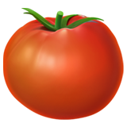
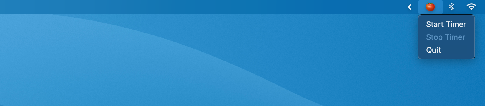

# Pomodoro – macOS Menubar App

Current release: [Pomodoro (Version 0.2)](https://github.com/visini/pomodoro/releases/tag/0.2.0)

See also: [visini/timebox](https://github.com/visini/timebox) - Menu bar utility app (macOS) for adding Timeboxing and Pomodoro workflow support to Things 3; including a standing desk integration.
